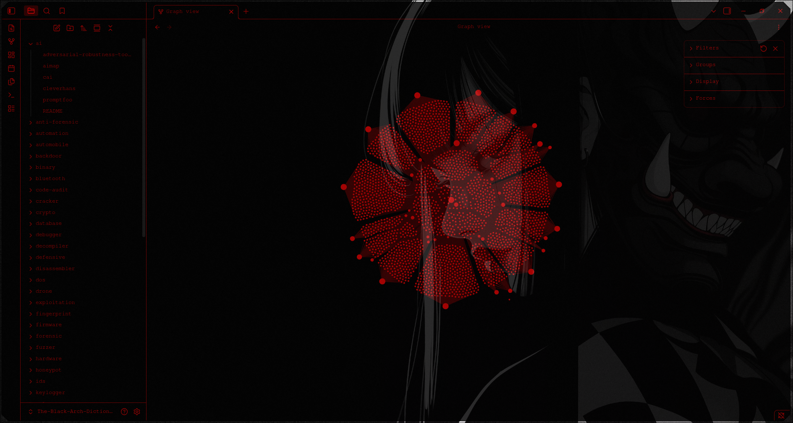

# Security Tools — Per-Tool Markdown Reference

  

This Obsdian Vault contains one Markdown file for every parsed tool from the provided tools list.
Each tool file includes installation commands, what the tool does, practical use cases, a first-run workflow, and safe lab-focused examples.

"With great power comes great responsibility"

-However that responsibility isnt mine 0-0

## Structure
- `MASTER_INDEX.md` — full index by category.
- `<category>/<tool>.md` — individual guide for each tool.

## Categories
- [ai](./ai/README.md) — 5 tools
- [anti-forensic](./anti-forensic/README.md) — 2 tools
- [automation](./automation/README.md) — 109 tools
- [automobile](./automobile/README.md) — 4 tools
- [backdoor](./backdoor/README.md) — 52 tools
- [binary](./binary/README.md) — 63 tools
- [bluetooth](./bluetooth/README.md) — 26 tools
- [code-audit](./code-audit/README.md) — 30 tools
- [cracker](./cracker/README.md) — 161 tools
- [crypto](./crypto/README.md) — 80 tools
- [database](./database/README.md) — 5 tools
- [debugger](./debugger/README.md) — 10 tools
- [decompiler](./decompiler/README.md) — 18 tools
- [defensive](./defensive/README.md) — 44 tools
- [disassembler](./disassembler/README.md) — 17 tools
- [dos](./dos/README.md) — 27 tools
- [drone](./drone/README.md) — 4 tools
- [exploitation](./exploitation/README.md) — 181 tools
- [fingerprint](./fingerprint/README.md) — 30 tools
- [firmware](./firmware/README.md) — 4 tools
- [forensic](./forensic/README.md) — 126 tools
- [fuzzer](./fuzzer/README.md) — 85 tools
- [hardware](./hardware/README.md) — 5 tools
- [honeypot](./honeypot/README.md) — 16 tools
- [ids](./ids/README.md) — 1 tools
- [keylogger](./keylogger/README.md) — 3 tools
- [malware](./malware/README.md) — 32 tools
- [misc](./misc/README.md) — 145 tools
- [mobile](./mobile/README.md) — 46 tools
- [networking](./networking/README.md) — 146 tools
- [nfc](./nfc/README.md) — 1 tools
- [packer](./packer/README.md) — 2 tools
- [proxy](./proxy/README.md) — 31 tools
- [radio](./radio/README.md) — 30 tools
- [recon](./recon/README.md) — 257 tools
- [reversing](./reversing/README.md) — 33 tools
- [scanner](./scanner/README.md) — 310 tools
- [sniffer](./sniffer/README.md) — 39 tools
- [social](./social/README.md) — 60 tools
- [spoof](./spoof/README.md) — 18 tools
- [stego](./stego/README.md) — 13 tools
- [threat-model](./threat-model/README.md) — 1 tools
- [tunnel](./tunnel/README.md) — 18 tools
- [voip](./voip/README.md) — 22 tools
- [webapp](./webapp/README.md) — 318 tools
- [windows](./windows/README.md) — 158 tools
- [wireless](./wireless/README.md) — 69 tools
- [wordlist](./wordlist/README.md) — 5 tools
- [uncategorized](./uncategorized/README.md) — 4 tools
